# Лабораторная работа 1. Интерактивная работа в системе. Пользовательская учетная запись

## Упражнение 1.1

**Пункт 4.** Зафиксируйте приглашение к вводу имени пользователя и расшифруйте его
составляющие:


Приглашение составляет следующие строки:

```bash
Debian GNU/Linux 13 arkady-unix tty1
arkady-unix login:
```

- Debian GNU/Linux - название дистрибутива ос Linux
- 13 - версия дистрибутива
- arkady-unix - имя компьютера в сети
- tty1 - имя терминала, содержащего приглашение; tt1 - первая виртуальная консоль

Вторая строка содержит приглашение системы ввести имя пользователя.

**Пункты 5, 6, 7, 8.**

Точное имя учетной записи автор запамятовал, поэтому был введен логин суперпользователя: root, и пароль суперпользователя, после чего терминал выдал приглашение на ввод от имена суперпользователя:


После ввода пароля также вывелось сообщение MOTD:

```
Linux arkady-unix 6.12.107+deb13-amd64 #1 SMP PREEMPT_DYNAMIC Debian 6.12.107-1 (2026-08-29) x86_64
```

Это сообщение выводится после успешного входа в систему. Оно содержит название ядра, имя хостовой машины, версию ядра Linux, номер сборки ядра, версию пакета ядра в Debian, дату сборки этой версии ядра и архитектуру процессора.

Также выводится информация о лицензии:

```
The programs included with the Debian GNU/Linux system are free software;
the exact distribution terms for each program are described in the
individual files in /usr/share/doc/*/copyright.
```

Приглашение ввести команду выглядит так:

```bash
root@arkady-unix:~#
```

- root -- имя пользователя (в данном случае - суперпользователь);
- @ - разделитель между именем пользователя и именем хостовой машины;
- arkady-unix -- имя хоста;
- : - разделитель;
- ~ - знак тильда, указывается перед названием директории, в которой находится пользователь;
- \# - приглашение к вводу (для обычного пользователя - \$);

Ниже приведен один из способов узнать логин другого пользователя и переключиться на него:


При создании учетной записи система автоматически создает в директории /home директорию, названную именем учетной записи. Итак, при вводе команды

```bash
ls /home
```

вывелось 

```bash
arkady-student
```

Теперь при помощи команды 

```bash
su - arkady-student
```

можно переключиться на учетную запись *arkady-student*.
Теперь приглашение к вводу строки выглядит так:

```bash
arkady-student@arkady-unix:~$
```

---

## Упражнение 1.2. Виртуальные терминалы.

При нажатии на комбинацию Alt + -> или Alt + <- происходит переключение между терминалами tty

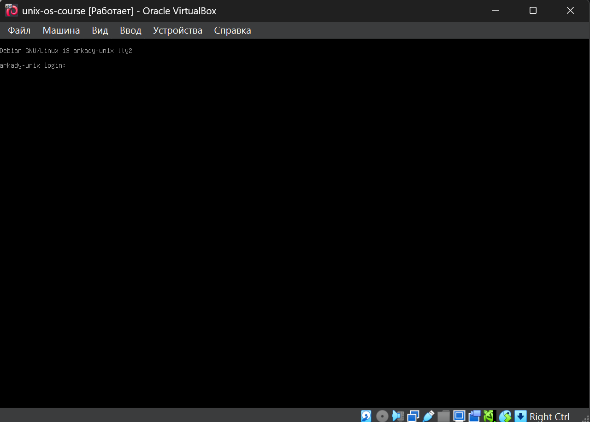

Сделан вход в терминалы 2, 4 и 6:


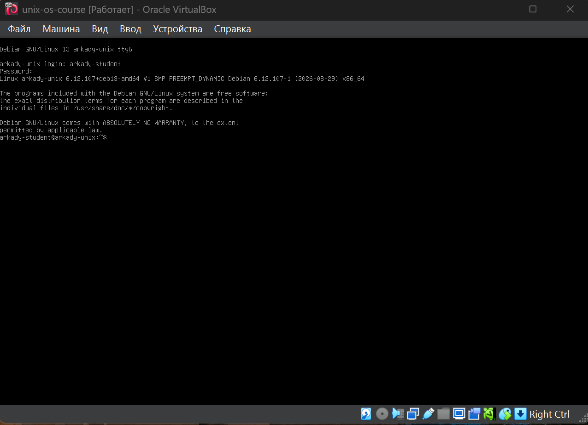

При помощи команды 

```bash
clear
```
очищен терминал tty1

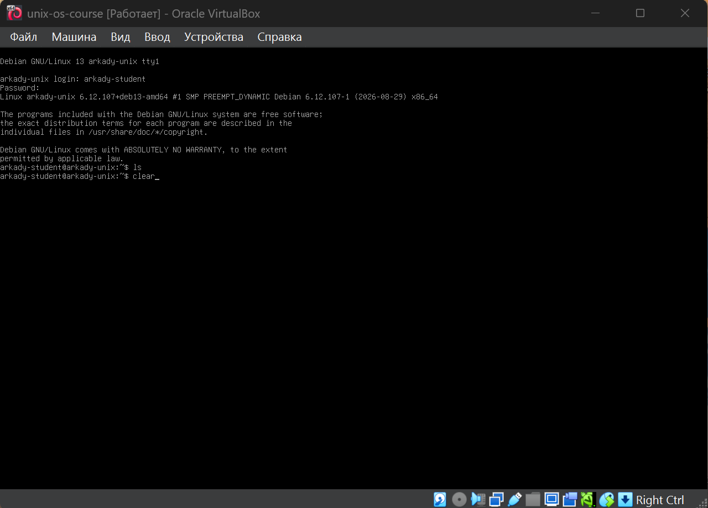

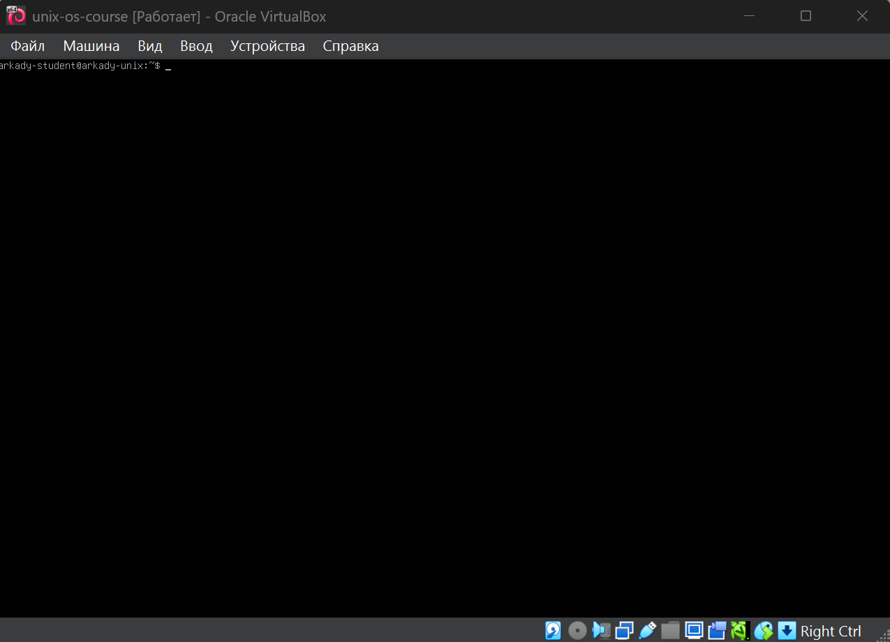


## Упражнение 1.3. Завершение сеанса.

При помощи команды

```bash
exit
```

произведен выход из терминалов

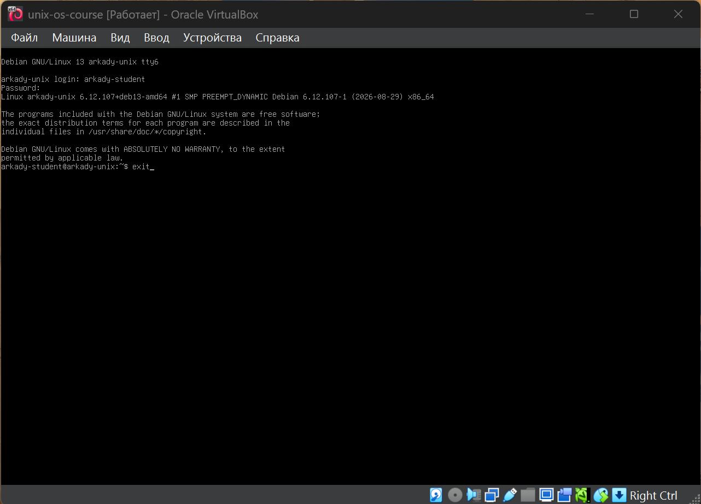

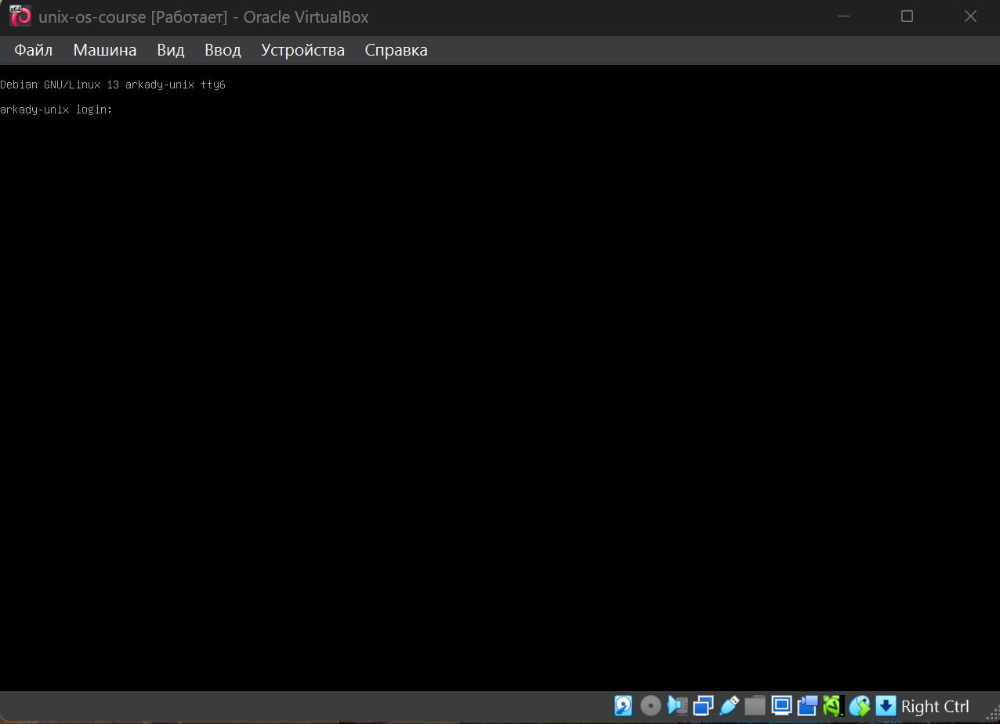


## Упражнение 1.4. Команды для получения информации о системе и работающих пользователях

# Вывод

В ходе работы были выполнены команды `whoami`, `id`, `users`, `who`, `w`, `date`, `cal`, `uname` и `uptime`.

С помощью этих команд была получена основная информация о системе:

* `whoami` — показывает имя текущего пользователя.
* `id` — показывает ID пользователя и его группы.
* `users` — показывает пользователей, которые сейчас вошли в систему.
* `who` — показывает информацию об активных пользователях и времени их входа.
* `w` — показывает пользователей и информацию об их текущей работе.
* `date` — показывает текущую дату и время.
* `cal` — показывает календарь.
* `uname` — показывает информацию об операционной системе и ядре.
* `uptime` — показывает, как долго работает система, и её нагрузку.

**Таким образом, данные команды позволяют быстро узнать информацию о пользователе, активных сеансах и текущем состоянии Linux-системы.**


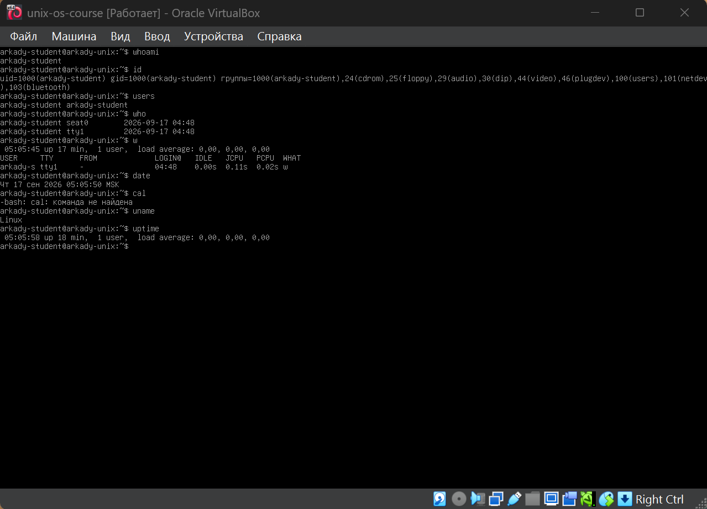


## Упражнение 1.5.

# Использование команд и сочетаний клавиш

В ходе работы были проверены следующие клавиши и команды:

* `←` — перемещает курсор на один символ влево.
* `→` — перемещает курсор на один символ вправо.
* `Del` — удаляет символ справа от курсора.
* `Ctrl + H` — удаляет символ слева от курсора, аналогично клавише Backspace.
* `Ctrl + U` — удаляет всю строку от курсора до её начала.
* `Tab` — используется для автоматического дополнения команд, имён файлов и каталогов.
* `history` — выводит список ранее выполненных команд.

**Вывод:** данные клавиши и команда `history` позволяют быстрее работать с командной строкой, редактировать введённые команды и просматривать историю предыдущих действий.


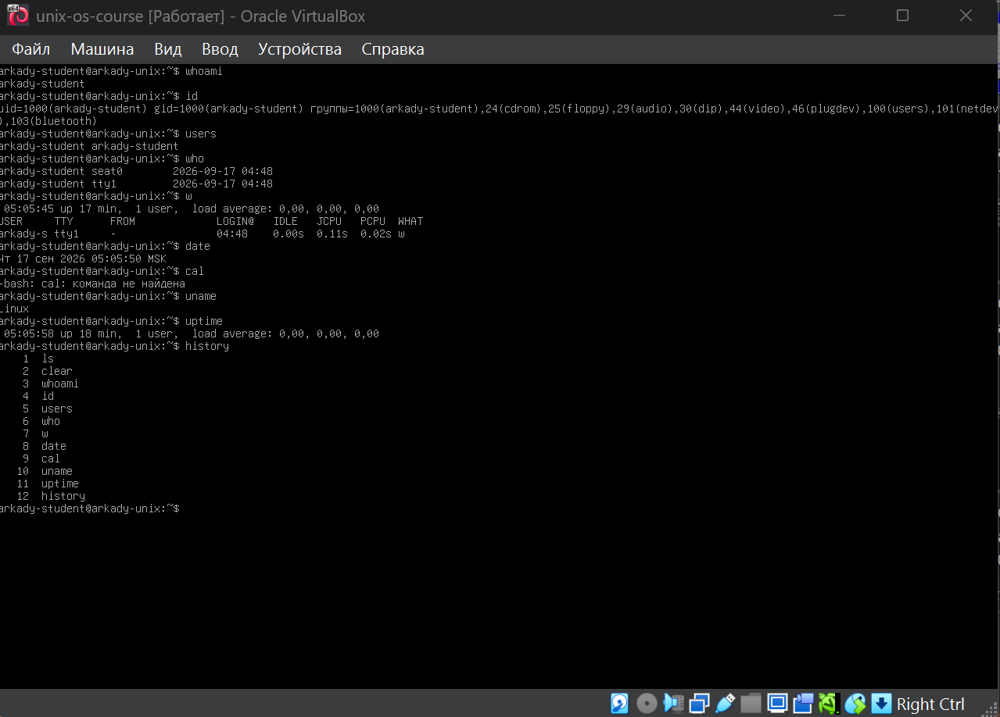

## Упражнение 1.6.

Ниже применение команды passwd для изменения пароля учетной записи:

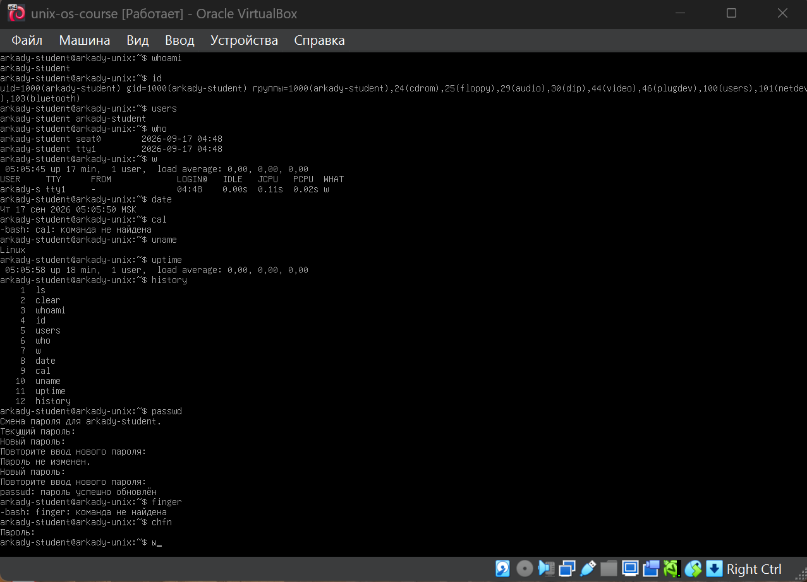

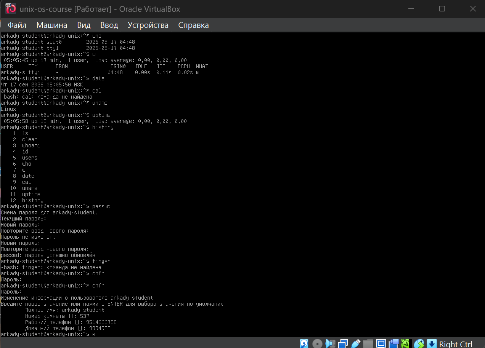

Для выполнения команды finger необходимо установить ее. Изначально sudo не установлен, эту и другие команды можно устанавливать через суперпользователя root, после чего использовать команду finger

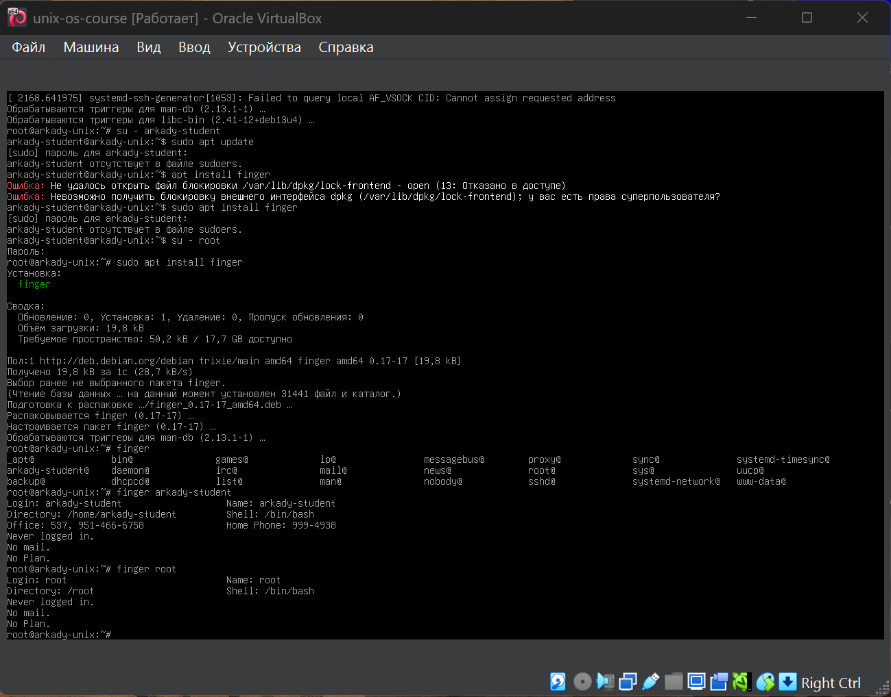

Команда chsh позволяет изменить оболочку интерпертатора

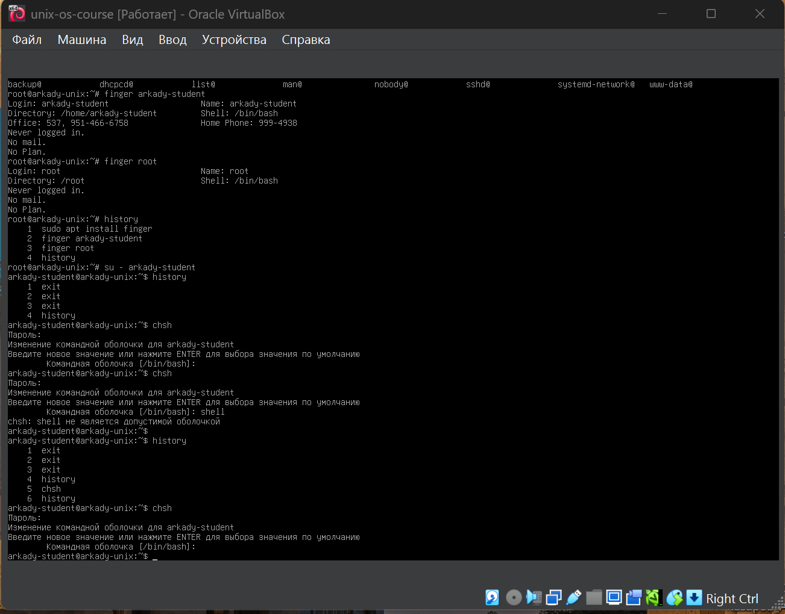


## Упражнение 1.7.

Для изменения контекста пользователя использовалась команда:

```bash
su aka
```

После перехода к другому пользователю были проверены его идентификаторы:

```bash
id
```

Для возврата к пользователю student использовалась команда:

```bash
exit
```

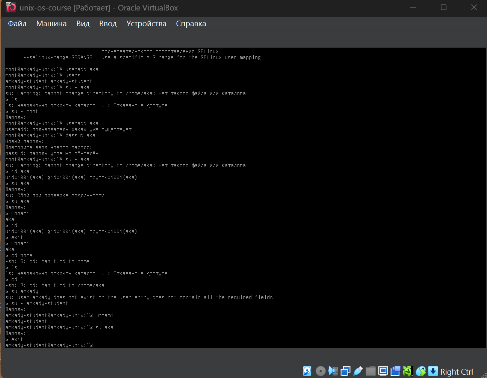

## Упражнение 1.8.

## Упражнение 1.9.


