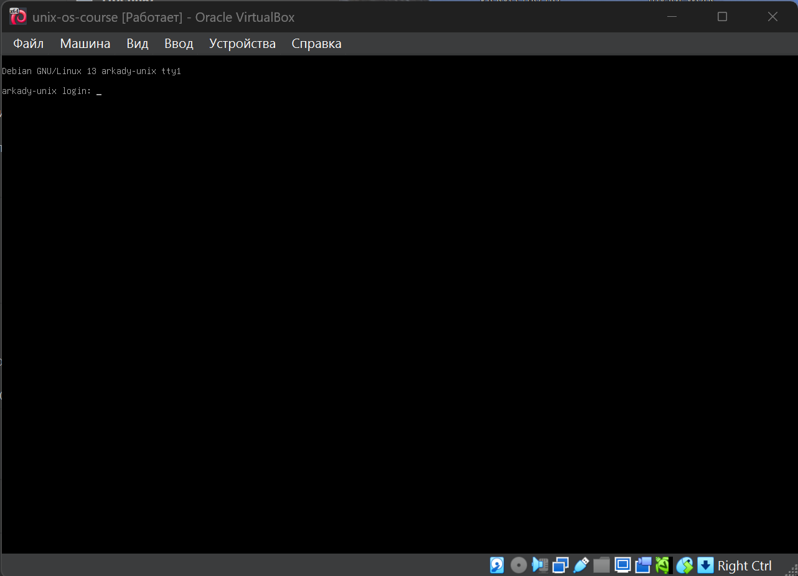
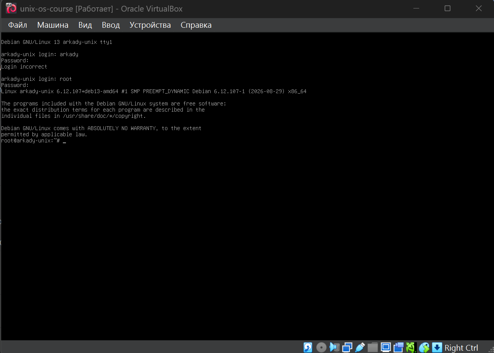
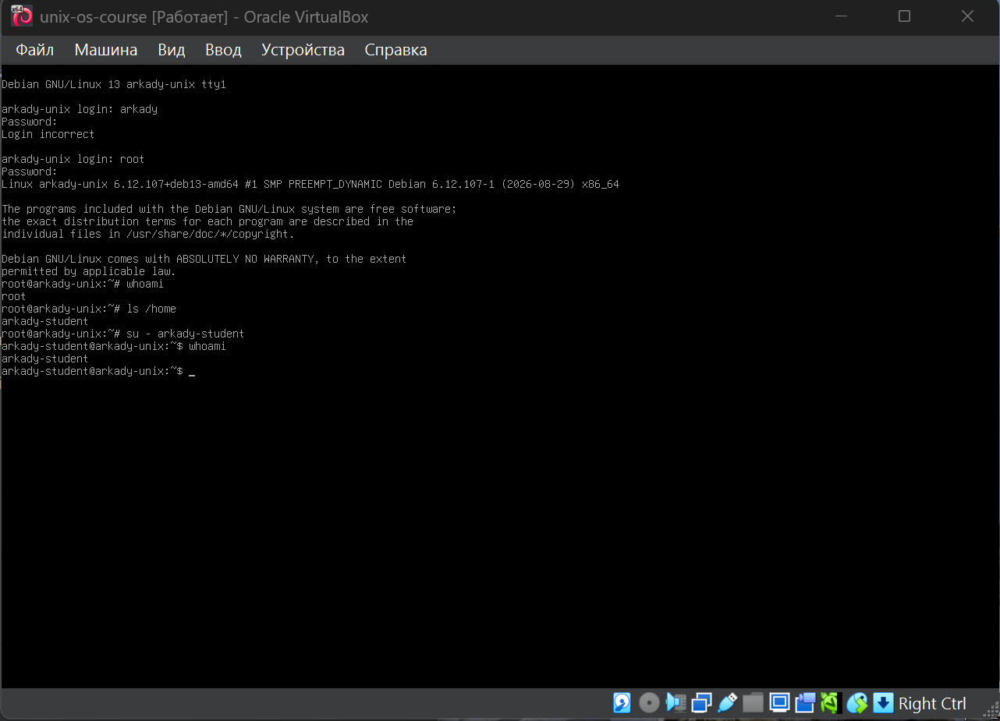

# Лабораторная работа 1. Интерактивная работа в системе. Пользовательская учетная запись

## Упражнение 1.1

**Пункт 4.** Зафиксируйте приглашение к вводу имени пользователя и расшифруйте его
составляющие:



Приглашение составляет следующие строки:

```bash
Debian GNU/Linux 13 arkady-unix tty1
arkady-unix login:
```

- Debian GNU/Linux - название дистрибутива ос Linux
- 13 - версия дистрибутива
- arkady-unix - имя компьютера в сети
- tty1 - имя терминала, содержащего приглашение; tt1 - первая виртуальная консоль

Вторая строка содержит приглашение системы ввести имя пользователя.

**Пункты 5, 6, 7, 8.**

Точное имя учетной записи автор запамятовал, поэтому был введен логин суперпользователя: root, и пароль суперпользователя, после чего терминал выдал приглашение на ввод от имена суперпользователя:



После ввода пароля также вывелось сообщение MOTD:

```
Linux arkady-unix 6.12.107+deb13-amd64 #1 SMP PREEMPT_DYNAMIC Debian 6.12.107-1 (2026-08-29) x86_64
```

Это сообщение выводится после успешного входа в систему. Оно содержит название ядра, имя хостовой машины, версию ядра Linux, номер сборки ядра, версию пакета ядра в Debian, дату сборки этой версии ядра и архитектуру процессора.

Также выводится информация о лицензии:

```
The programs included with the Debian GNU/Linux system are free software;
the exact distribution terms for each program are described in the
individual files in /usr/share/doc/*/copyright.
```

Приглашение ввести команду выглядит так:

```bash
root@arkady-unix:~#
```

- root -- имя пользователя (в данном случае - суперпользователь);
- @ - разделитель между именем пользователя и именем хостовой машины;
- arkady-unix -- имя хоста;
- : - разделитель;
- ~ - знак тильда, указывается перед названием директории, в которой находится пользователь;
- \# - приглашение к вводу (для обычного пользователя - \$);

Ниже приведен один из способов узнать логин другого пользователя и переключиться на него:



При создании учетной записи система автоматически создает в директории /home директорию, названную именем учетной записи. Итак, при вводе команды

```bash
ls /home
```

вывелось 

```bash
arkady-student
```

Теперь при помощи команды 

```bash
su - arkady-student
```

можно переключиться на учетную запись *arkady-student*.
Теперь приглашение к вводу строки выглядит так:

```bash
arkady-student@arkady-unix:~$
```

## Упражнение 1.2. Виртуальные терминалы.